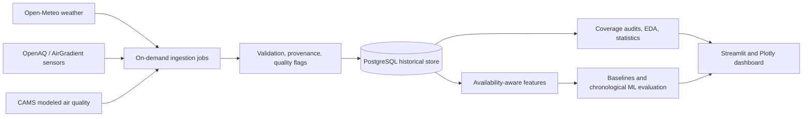

# Vietnam Weather & Air Quality Analytics

A Data Science portfolio project investigating weather, PM2.5, and short-horizon
air-quality prediction in Vietnamese urban areas. The intended workflow combines
continuous data collection with historical analysis, statistical inference,
leakage-aware model evaluation, and an interactive analytical dashboard.

**Status: Phase 8 delivered: reproducible chronological baselines completed.** On-demand
polling and resumable backfill persist measured and modeled data to Supabase
PostgreSQL; a frozen data-quality audit and descriptive EDA feed a pre-registered
association study; an availability-aware feature pipeline (6h/24h horizons) is
built and verified; and a database-free baseline runner evaluates persistence,
strict trailing means, train-only local-hour climatology and an optional
weather-augmented diagnostic under the inherited chronological split and purge.
The frozen historical window contains no prospectively captured evidence, so the
captured feature artifact and the baseline artifact are limited diagnostics, and
a prospective collection period is required before baselines on real data.
Dashboard work, Phase 9 model training and scheduling remain future phases. No
model-performance or operational-forecast claims exist.

## Phase 8 Results

- Database-free, deterministic baseline runner over the Phase 7 artifact: every
  declared input hash, the summary manifest digest, feature version, horizons,
  captured basis, split/purge metadata and feature/target key alignment are
  verified before fitting. Required input hashes cannot be omitted; replay
  binds the complete manifest and purpose and supports relocated identical
  inputs. No test row is used for fitting or selection.
- Declared baselines: `persistence_last_available` (primary history-only
  reference), `persistence_lag_1h`, `trailing_mean_24h`, train-only
  `local_hour_climatology` and `weather_augmented_climatology` (only when finite
  captured weather features exist; no ERA5/CAMS/assumed fallback).
- The frozen Phase 7 artifact has zero usable captured PM/weather feature
  evidence, so the authoritative artifact is a limited diagnostic: 72 of 90
  metric cells are unavailable with explicit reasons and no fabricated scores,
  while the 18 local-hour climatology cells use non-purged training targets only
  and remain descriptive calendar diagnostics.
- Verification: 26 baseline tests passed; the offline suite ran 209 tests
  (207 passed, 2 credential skips); 52 isolated PostgreSQL tests passed. CLI
  run and CLI/module replay match the authoritative v2 artifact byte-for-byte
  (5/5 files including `SUCCESS.json`); `git diff --check` clean. No study
  database write, migration or schedule was added.
- Real baseline evaluation remains blocked until the prospective collection
  period supplies captured evidence.

See the [Phase 8 verification](docs/verification/phase_8.md), [Phase 8 plan](docs/verification/phase_8_plan.md) and the authoritative
[baseline summary](docs/verification/phase_8_baselines_2026-09-11_v2_verified/phase_8_baselines_summary.json).
No forecast-skill or model-performance claim exists.

## Phase 7 Results

- Read-only extractor plus a pure deterministic builder: for every forecast
  origin, every feature is derived only from data whose evidence timestamps
  strictly precede the origin; targets are aligned to the exact horizon
  contract and stored separately from features.
- Catalog: exact PM2.5 lags (1–72h), last-available value with exposed age,
  strict trailing means/std with observation counts, calendar features,
  forecast-weather features (wind direction only as sin/cos), per-row lineage
  and missingness reasons.
- One shared 60/20/20 chronological split for both sensors and horizons
  (validation starts 2026-07-31T10:00Z, test starts 2026-08-18T05:00Z) with
  horizon-overlap purge reported separately (112 rows); the final test period
  stays untouched.
- Captured artifact is a limited diagnostic: all 4,215 measured rows were
  retrieved after the historical window (backfill/poll), so captured
  availability is zero and the artifact records
  `prospective_collection_period_required = true` with all data features null
  and explicit reasons. The final pipeline (`phase7_features_v7`) adds
  prospective-window support with an optional frozen-boundary assertion, 72h
  warm-up extraction, assumed-mode forecast event-time policy, source/vintage
  identity checks (product, purpose, model key, coordinates), value-level
  lineage/leakage, null-label target semantics, period_start validation,
  config/bundle boundary checks, complete reviewed variable/sensor/location
  registry validation, derived sensor metadata and snapshot/product identity
  binding, structural malformed-input rejection and summary-bound replay. Assumed-lag mode is
  implemented and tested but requires explicit user authorization and is never
  an operational backtest.
- Verification: 85 non-CLI v7 builder/regression tests, pure-builder v7
  build/replay with byte-identical six-file output, complete registry and
  input-table hash verification, and preserved prior full gates (180 offline,
  52 isolated PostgreSQL). The earlier macOS dataless `.venv` hydration stall
  was resolved during Phase 8: the full suite, including Phase 7 CLI replay
  tests, and the 52-test isolated PostgreSQL suite now pass.
  `git diff --check`, one live read-only Supabase extraction. Status counts
  usable accepted evidence only: invalid-only input can never produce
  `status = ok`.

See the [Phase 7 verification](docs/verification/phase_7.md),
[Phase 7 plan](docs/verification/phase_7_plan.md) and the authoritative
[feature summary](docs/verification/phase_7_features_2026-09-10_structural_hardened/phase_7_feature_summary.json).
No forecast-skill, model-performance or operational claim exists.

## Phase 6 Results

- Pre-registered H1: after adjustment for sensor, Vietnam local hour, weekday and
  a bounded date trend, log1p(PM2.5) changes by −0.208 per one
  analysis-window standard deviation of ERA5 wind speed (95% block-bootstrap
  interval −0.257 to −0.166; Holm-adjusted bootstrap p = 0.002) over 3,951
  accepted sensor-hours.
- H2 humidity: adjusted estimate +0.099 (interval −0.006 to +0.186) — not
  significant after Holm adjustment (adjusted p = 0.068).
- H3 site contrast on the 2,035 shared accepted hours: OceanPark is +0.179
  log1p(PM2.5) relative to CMT8 (interval +0.060 to +0.296), an exploratory
  sensor contrast, not a city comparison.
- Secondary family (temperature, precipitation, pressure, cloud cover,
  radiation) under Benjamini–Hochberg FDR: only cloud cover survives (adjusted
  p = 0.010). Wind speed conclusions are stable across raw scale, 48-hour and
  168-hour blocks, complete-weather rows and the predeclared extreme-value rule.
- Uncertainty uses 2,000 moving-block bootstrap replicates over Vietnam local
  calendar days (seed 20260908, 1/2/7-day blocks, gaps preserved, exactly 91
  dates per replicate), gated on non-overlapping independent date partitions
  (91/46/13 by block length), with Holm and Benjamini–Hochberg multiple-testing
  control and three explicit labels: inferential (adjusted family members only),
  exploratory (unadjusted), descriptive_only. No imputation; CAMS and provider
  forecasts stay out of the measured-target models.

These are sensor-level associations over one 90-day window at two non-reference
low-cost sites — not city-wide exposure, causal effects, or validated forecast
skill. See the [Phase 6 verification](docs/verification/phase_6.md),
[Phase 6 plan](docs/verification/phase_6_plan.md) (with the 2026-09-09 correction
addendum) and the frozen
[statistics bundle](docs/verification/phase_6_statistics_2026-09-09_corrected/phase_6_statistics_summary.json).
The earlier 2026-09-08 output is superseded by the documented correction and
preserved unchanged.

## Phase 3 Results

- 4,191 measured PM2.5 hours in the verified 90-day window, plus recent polling
  data for CMT8 and OceanPark. Missing periods remain explicit gaps.
- 85 available days of ERA5 weather at the actual station coordinates and 90 days
  of separate CAMS modeled context for Hanoi, HCMC and Da Nang.
- Raw-response evidence, UTC timestamps, metadata/licence validation, retries,
  rate/request/storage budgets, quarantine, revisions and resumable checkpoints.
- Live repeat checks produced zero new measured/ERA5 rows for unchanged queries;
  the measured backfill resumed with zero API calls.
- 53 offline tests and 45 isolated PostgreSQL tests passed. About 45 MB in
  Supabase, with no paid resource or service upgrade.

See the [Phase 3 verification](docs/verification/phase_3.md),
[Phase 4 verification](docs/verification/phase_4.md),
[Phase 5 verification](docs/verification/phase_5.md),
[captured count report](docs/verification/phase_3_counts.json), and
[ingestion commands](docs/ingestion.md). These are data-acquisition results, not
evidence of sensor accuracy, city-wide pollution levels or predictive skill.

## Phase 2 Results

- PostgreSQL schema separating measured concentrations, reanalysis/model values,
  provider forecast captures and project predictions.
- Immutable observation revisions and raw-response provenance with computed
  hashes; foreign keys, canonical units, time/quality constraints and query indexes.
- Validated editable configuration for three cities and two measured stations,
  including licences, source identifiers and known qualification limitations.
- Transactional Alembic migrations, idempotent metadata seeding, and a setup CLI.
- 25 tests against an isolated PostgreSQL cluster, plus 27 offline tests. Tests
  include migration rollback/re-upgrade, revisions, as-of queries and source-kind
  separation. See the [Phase 2 verification record](docs/verification/phase_2.md).

Reference metadata contains 4 products, 16 variables, 5 locations and 2 sensors.
Supabase now contains the verified Phase 3 historical loads; the separate local
development database contains bounded live smoke data. No synthetic test records
were inserted into either study database. Project model/prediction tables are empty.

Read the [architecture](docs/architecture.md), [Phase 4 verification](docs/verification/phase_4.md), [Phase 5 plan](docs/verification/phase_5_plan.md), [Phase 6 plan](docs/verification/phase_6_plan.md), [Phase 6 verification](docs/verification/phase_6.md), [Phase 7 plan](docs/verification/phase_7_plan.md), [Phase 7 verification](docs/verification/phase_7.md), [Phase 8 plan](docs/verification/phase_8_plan.md), [Phase 8 verification](docs/verification/phase_8.md), [schema and setup](docs/database.md)
and [source contracts](docs/source_contracts.md). A free-tier deployment can use
the documented [Supabase setup](docs/supabase.md).

## Research Question

How are weather conditions associated with variation in ground-level PM2.5 at
monitored locations in Vietnam, and does weather information available at forecast
time improve 6-hour and 24-hour predictions beyond recent PM2.5 history?

The study investigated Hanoi, Ho Chi Minh City, and Da Nang. Authenticated research
supports an initial measured-data study at CMT8 in HCMC and OceanPark in the Hanoi
urban area. Da Nang remains modeled-only because no OpenAQ location appeared
within 25 km of the study point. Neither a sensor nor a city-centre model grid
cell represents a population-wide mean.

Short-horizon forecasts could inform same-day or next-day planning. This project
will evaluate that potential, not provide validated health or safety advice.
The scientific contribution will be an honest assessment of weather's incremental
predictive value, including cases where a simple baseline wins.

## Phase 1 Results

Official documentation and terms checked on **7 September 2026, Vietnam time**:

| Source | Decision | Reason |
| --- | --- | --- |
| Open-Meteo weather | Selected for the first ingestion implementation | Keyless non-commercial access, usable historical weather, required variables, successful three-city probes |
| OpenAQ v3 / AirGradient | Selected for a two-location measured-data MVP | Authorized access verified; two CC BY 4.0 sensor feeds and a 90-day hourly audit; non-reference sensor limitations remain |
| Open-Meteo air quality / CAMS Global | Selected as a separate modeled-data stream | Three-city coverage and historical sample verified; **not measured ground truth** |
| OpenWeather Free | Reserve candidate | Useful free air-pollution history; requires a key and ODbL-aware data handling; provenance needs further qualification |
| WAQI | Not selected for the historical pipeline | Pollutant sub-indices differ from concentrations; archived-data redistribution restrictions |
| WeatherAPI | Not selected for permanent current/forecast collection | Retention limits conflict with this project; free AQ history unavailable |
| Direct CAMS ADS | Optional later research archive | Free model/reanalysis datasets; account, licence acceptance, and larger retrieval workflow |
| Vietnam CEM / Envisoft portal | Further investigation required | Public environmental information does not establish an open, licensed collection API |

Read the [full API comparison](docs/data_sources.md),
[research evidence and environment report](docs/research/phase_1.md), and
[scientific source decision](docs/decisions/0001-data-sources.md).
The comparison records quotas, authentication, history, forecasts, variables,
resolution, timestamps, stability, attribution, and collection restrictions.

## Verified So Far

- Three GeoNames city matches, with provider IDs and coordinates.
- Weather and air-quality JSON at all three coordinates, with six hourly values
  per city and requested current conditions.
- Twenty-four hourly historical values per city for **2023-01-01 UTC**, from
  ERA5 weather and the Open-Meteo air-quality archive.
- Expected variable units, matching array lengths, nonmissing sample values,
  monotonic hourly UTC timestamps, and a documented HTTP 400 error response.
- The original Phase 1 suite of 21 offline tests for response contracts, interval completeness,
  credential-safe redirects, evidence integrity, local links and secret exclusion.
- Authenticated discovery of 59 Vietnamese locations; two selected sensors
  supplied 4,191 hourly PM2.5 records in a common 90-day qualification window.

The captures verify access and payload structure, not environmental accuracy or
year-round completeness. See [captured evidence](docs/research/evidence/README.md)
for attribution and limitations. After the initial keyless HTTP 401, the user
authorized an OpenAQ key and authenticated requests succeeded.

| Measured Location | Expected Hours | Present Hours | Completeness | Longest Gap |
| --- | --- | --- | --- | --- |
| CMT8, HCMC | 2,160 | 2,154 | 99.72% | 3 hours |
| OceanPark, Hanoi urban area | 2,160 | 2,037 | 94.31% | 119 hours |

Window: 2026-06-08 00:00 to 2026-09-06 00:00 UTC, using fully enclosed hourly
periods. These are **coverage findings**, not pollution or model-performance
results. Both sensors are non-reference AirGradient instruments. Phase 3 observed
a named OceanPark instrument, but calibration and siting remain unverified.
Credit OpenAQ, AirGradient and CMT8's
named data contributor Thomas Versteeg under [CC BY 4.0](https://creativecommons.org/licenses/by/4.0/).
See the [authenticated qualification report](docs/research/openaq_qualification.md).

## Architecture

The database, reviewed configuration and on-demand ingestion exist. Scheduling,
analytical computation and dashboard components below remain planned.



Phase 2 establishes the schema and source/analytical contracts, including revisions,
forecast provenance and availability semantics. PostgreSQL is the persistent
store; research JSON files remain small, separately labeled evidence artifacts.

## Scientific Commitments

- Preserve raw values and quality flags; investigate extremes instead of deleting
  every outlier or treating missing pollutants as zero.
- Match weather to station coordinates and measurement intervals. Report
  geographic coverage and missingness before comparing cities.
- Use descriptive analysis, effect sizes, and dependence-aware uncertainty.
  Seasonal confounding and autocorrelation matter; correlation alone cannot
  establish a weather effect.
- Fit transformations only on training data. Use shared chronological cutoffs
  across locations, purge overlapping target windows, and reserve a final test
  period before model selection.
- Compare persistence, trailing averages, and time-of-day baselines before Ridge
  or tree-based models. Evaluate weather's contribution through ablations.
- Report MAE, RMSE, R-squared, per-city results, and uncertainty around differences
  from baselines. Do not assume a machine-learning model will improve forecasts.
- Treat feature importance as predictive evidence, not a causal explanation.

The [source decision](docs/decisions/0001-data-sources.md) explains the distinction
between retrospective association analysis and deployable forecasting. Full
methodology and evaluation reports will follow real data qualification.

## Setup

Requires Python 3.11+ and PostgreSQL 15+. From the repository root:

```bash
python3 -m venv .venv
.venv/bin/python -m pip install -r requirements.lock
.venv/bin/python -m pip install --no-deps .
.venv/bin/vn-air validate-config configs/study.json
```

For a fresh local database, run `createdb vietnam_environment` once. It already
exists on the inspected workspace; do not recreate or drop it. Then:

```bash
export DATABASE_URL='postgresql+psycopg:///vietnam_environment'
.venv/bin/vn-air db upgrade
.venv/bin/vn-air db seed --config configs/study.json
.venv/bin/vn-air db status
```

Database commands require an explicitly selected database and do not load `.env`.
Keep remote credentials in an ignored environment or secret store. Full connection,
metadata-versioning and installation details are in [database.md](docs/database.md).

For Supabase, export the credentials from your own trusted ignored `.env` rather
than the local-database example above. Then run bounded polling:

```bash
set -a
source .env
set +a
.venv/bin/vn-air db upgrade
.venv/bin/vn-air ingest poll --source openaq --max-requests 10
.venv/bin/vn-air ingest poll --source weather --max-requests 5
.venv/bin/vn-air ingest poll --source cams --max-requests 5
.venv/bin/vn-air report
```

No schedule is installed. The [ingestion runbook](docs/ingestion.md) documents
historical backfills, repeat/resume behavior, limits and partial/failure exit codes.

Test source code without API calls or changes to the existing database:

```bash
PYTHONPATH=src .venv/bin/python -B -m unittest discover -s tests -v
PYTHONPATH=src .venv/bin/python -B scripts/test_database.py
```

The integration runner needs PostgreSQL server binaries on PATH and creates its
own disposable socket-only cluster. The exact API-key exclusion test skips when
`OPENAQ_API_KEY` is not exported. All other offline checks need no credential.
The regular installed package works without `PYTHONPATH`; use it for local source
development and reinstall after edits when testing the installed CLI.

## Research Probes

The Phase 1 probe scripts use only the Python standard library. The application
package and complete test suite also require the Phase 2 dependencies above.

Run offline tests without API calls:

```bash
PYTHONPATH=src .venv/bin/python -B -m unittest discover -s tests -v
```

Repeat the bounded live probe with a **new output filename**:

```bash
python3 -B scripts/probe_sources.py --output docs/research/evidence/local_probe.json
```

The probe makes at most eight sequential requests, separated by a one-second
delay, with 30-second timeouts and no automatic retries. It refuses to overwrite
evidence. It does not read API keys, create accounts, or connect to a database.

On the inspected macOS Python installation, the default CA bundle was missing.
The successful run used the existing system trust bundle for that command only:

```bash
SSL_CERT_FILE=/etc/ssl/cert.pem python3 -B scripts/probe_sources.py --output docs/research/evidence/local_probe_system_ca.json
```

Use this override only where that trust bundle exists. On other machines,
configure the interpreter's certificate store. Do not disable TLS verification.

For authenticated research, a new user needs a free
[OpenAQ account](https://explore.openaq.org/register) and `OPENAQ_API_KEY`, as
described in [.env.example](.env.example). This workspace already has the
user-authorized key in ignored `.env` with owner-only permissions. Keep credentials
out of source control, client-side code, request logs and future chat messages.

The [OpenAQ research instructions](docs/research/openaq_qualification.md) describe
loading the variable, staged captures and the offline coverage audit.
`probe_sources.py` stays keyless; `probe_openaq.py` reads the exported environment
variable and sends it only to OpenAQ in `X-API-Key`.

There are no model-training, dashboard, scheduler or Docker commands yet. Full
data-quality audits come next; acquisition success does not establish scientific
validity for every analysis.

## Roadmap

| Phase | Acceptance Evidence | Status |
| --- | --- | --- |
| 1. Research | Official-source comparison, live payload checks, measured-source audit | Delivered; two-location measured MVP supported, broader qualification ongoing |
| 2. Architecture | Executable schema, provenance/source contracts, configuration, isolated database tests | Delivered; dedicated local database migrated and metadata seeded |
| 3. MVP ingestion | Real data persisted in PostgreSQL; repeat/revision/recovery behavior verified | Delivered; on-demand jobs and bounded Supabase backfill, no schedule yet |
| 4. Data quality | Audits of missingness, units, duplicates, gaps, anomalies | Delivered; frozen audit and dated artifact |
| 5. EDA | Coverage-qualified temporal, geographic, and weather comparisons | Delivered; frozen descriptive outputs and SVG plots |
| 6. Statistics | Stated hypotheses, assumptions, effect sizes and uncertainty | Delivered; pre-registered estimates, intervals and sensitivity matrix |
| 7. Features | Availability-time and leakage tests | Delivered; captured limited diagnostic, prospective collection required |
| 8. Baselines | Reproducible chronological baseline results | Delivered; deterministic engine and limited-diagnostic artifact, prospective captured data required |
| 9. ML | Walk-forward comparisons, final holdout, ablations and interpretation | Planned |
| 10. Dashboard | Analytical views, source labels, working interactions | Planned |
| 11. Automation | Scheduled ingestion, failure alerts, recovery and backups | Planned |
| 12. Portfolio polish | Executed notebooks, results, screenshots, reproducible runbook | Planned |

## Limitations

No source currently establishes a complete, up-to-date measured PM2.5 dataset for
all three cities in this repository. The two selected low-cost sensor locations
cannot establish city-wide exposure, and their common record has not yet covered
a full annual cycle. Exact siting and calibration need further qualification.
CAMS covers Vietnam but represents coarse
modeled atmospheric conditions. Reanalysis and retrospectively retrieved values
may incorporate information unavailable to a historical forecaster. Free hosted
APIs can change their terms, data, quotas, or availability without guaranteeing
continuity. Licences for code, stored datasets, and hosted API access are separate
questions.

**Best model, EDA findings, statistical results, and lessons from modeling remain
unreported until the corresponding work has been performed and verified.**
