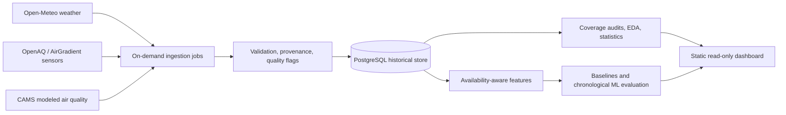

# Vietnam Weather & Air Quality Analytics

A Data Science portfolio project investigating weather, PM2.5 and short-horizon
air-quality prediction in Vietnamese urban areas. It combines bounded,
provenance-preserving data collection with a frozen data-quality audit, a
pre-registered association study, availability-aware feature engineering,
chronological baselines, deterministic Ridge/tree diagnostics and a local
read-only dashboard.

**Status: Phase 12 portfolio polish complete.** The local research and portfolio
system is complete through Phase 12. Two gates remain deliberately outside
"complete": operational activation (no scheduler installed, dedicated ingestion
role provisioned, supervised live cycle run or real project backup created) and
prospective captured-data evaluation (the frozen
window contains no prospectively captured evidence, so the Phase 7-9 artifacts
are limited diagnostics). Both require separate, explicit authorization.

New reader? The [curated results summary](reports/portfolio_summary.md) and the
[portfolio runbook](docs/portfolio_runbook.md) are the fastest routes into the
project. With prerequisites installed, the walkthroughs and dashboard reproduce
from local artifacts without credentials or provider access. The database test
suite uses a disposable local cluster.

## Research question

How are weather conditions associated with variation in ground-level PM2.5 at
monitored locations in Vietnam, and does weather information available at
forecast time improve 6-hour and 24-hour predictions beyond recent PM2.5
history?

The study investigated Hanoi, Ho Chi Minh City and Da Nang. Authenticated
research supports an initial measured-data study at CMT8 in HCMC and OceanPark
in the Hanoi urban area. Da Nang remains modeled-only because no OpenAQ location
appeared within 25 km of the study point. Neither a sensor nor a city-centre
model grid cell represents a population-wide mean. Short-horizon forecasts could
inform same-day planning; this project evaluates that potential and provides no
validated health or safety advice.

## Data scope and source separation

| Stream | What it is | How the project uses it |
| --- | --- | --- |
| OpenAQ PM2.5 | Measured observations at two non-reference AirGradient sensors (CMT8, OceanPark) | Target and history; sensor-level records, never city averages |
| ERA5 | Retrospective reanalysis weather at station coordinates | Descriptive and adjusted weather context; retrieval time is not historical availability |
| Open-Meteo forecasts | Provider forecast snapshots | Captured-availability weather source only; never ground truth |
| CAMS via Open-Meteo | Modeled air-quality fields for Hanoi, HCMC and modeled-only Da Nang | Separate modeled context; never a measured replacement |

Frozen window: 2026-06-08T00:00Z to 2026-09-06T00:00Z, cutoff
2026-09-06T20:59:00.669630Z. CMT8 covers 2,154 of 2,160 hours (99.72%);
OceanPark covers 2,037 of 2,160 (94.31%, including a 119-hour outage from
2026-07-01 to 2026-07-06). Missing hours stay missing: no interpolation and no
model substitution. See the [Phase 4 record](docs/verification/phase_4.md).

## Key results and evidence limits

Each item carries its result label. Only adjusted Phase 6 family results are
inferential; everything else is exploratory or descriptive.

- **Data quality (descriptive_only).** All 4,191 selected measured hours were
  provisionally accepted; 24 CMT8 revision transitions changed source metadata
  only, never the PM2.5 value. The OceanPark outage and every gap remain visible.
- **Descriptive EDA (exploratory).** CMT8 PM2.5: mean 22.71, median 20.9,
  maximum 82.2 ug/m3. OceanPark: mean 32.01, median 31.1, maximum 149.0 ug/m3.
  One-hour persistence r = 0.810 / 0.869; the largest descriptive weather
  correlation is wind speed, -0.339 / -0.310.
- **Phase 6 wind speed (inferential).** After adjustment for sensor, Vietnam
  local hour, weekday and a bounded date trend, log1p(PM2.5) changes by -0.208
  per one analysis-window standard deviation of wind speed (95% block-bootstrap
  interval -0.257 to -0.166; Holm-adjusted p = 0.002) over 3,951 accepted
  sensor-hours.
- **Phase 6 humidity (inferential family member, not significant).** Adjusted
  estimate +0.099 (interval -0.006 to +0.186; Holm-adjusted p = 0.068).
- **Phase 6 site contrast (exploratory).** On the 2,035 shared accepted hours,
  OceanPark is +0.179 log1p(PM2.5) relative to CMT8 (interval +0.060 to +0.296)
  — a sensor contrast, not a city comparison.
- **Phase 6 secondary family (inferential after BH).** Of temperature,
  precipitation, pressure, cloud cover and radiation, only cloud cover survives
  Benjamini-Hochberg FDR 0.05 (estimate -0.090, BH p = 0.010). Wind-speed
  conclusions are stable across raw scale, 48/168-hour blocks, complete-weather
  rows and the predeclared extreme-value rule; seven-day blocks are
  descriptive-only by the gate.
- **Phase 7 features (limited_diagnostic).** 8,548 feature rows over 2,137
  origins with one shared 60/20/20 chronological split, 72-hour warm-up and
  horizon purge. Captured PM-history and forecast-weather origins are both zero
  because no evidence predates a historical origin; a prospective collection
  period is required before captured operational features exist.
- **Phase 8 baselines (descriptive_only).** 72 of 90 metric cells are
  unavailable with explicit reasons and no fabricated scores; the 18 available
  cells are train-only local-hour calendar diagnostics.
- **Phase 9 ML (descriptive_only).** 24 of 96 model instances (calendar-only)
  trained, 72 of 288 metric cells available, 216 unavailable with reasons;
  65,424 predictions and 360 fit-history-qualified comparisons; test was never
  used for selection. No history or weather model has been evaluated on real
  data, so there is no forecast-skill or model-superiority claim.

These are sensor-level associations over one 90-day window at two non-reference
low-cost sites — not city-wide exposure, causal effects or validated forecast
skill. The superseded 2026-09-08 Phase 6 output is preserved unchanged. See the
[Phase 6 record](docs/verification/phase_6.md) and
[plan](docs/verification/phase_6_plan.md), the
[frozen statistics bundle](docs/verification/phase_6_statistics_2026-09-09_corrected/phase_6_statistics_summary.json),
the [Phase 7 record](docs/verification/phase_7.md), the
[Phase 8 record](docs/verification/phase_8.md), the
[Phase 9 record](docs/verification/phase_9.md) and the
[curated summary](reports/portfolio_summary.md). The Phase 12 walkthroughs
present these numbers with hash verification in the
[frozen walkthrough bundle](docs/verification/phase_12_portfolio_2026-09-14_review_corrected/manifest.json).

## Local dashboard: Vietnam Air Observatory

The dashboard is a static, loopback-only presentation of the hash-verified
public projection of the frozen Phase 5-9 artifacts. It has no database API, no
external assets and fits nothing in the browser.

```bash
python3 -B scripts/serve_dashboard.py
```

Open http://127.0.0.1:8765/ and stop with Ctrl-C. Five views cover the overview,
air quality, weather context, model diagnostics and methods/provenance, with
station/date filters, keyboard-inspectable charts, table alternatives, CSV
export, light/dark themes and responsive layouts. A curated Phase 12 screenshot
set is in
[reviewed screenshots](docs/verification/phase_12_screenshots_2026-09-14_review_verified/screenshots_manifest.json).

Reproduce the public bundle (new output path required, then byte-compare):

```bash
python3 -B scripts/build_dashboard.py --output /private/tmp/vietnam-air-replay.json
cmp dashboard/data/dashboard.json /private/tmp/vietnam-air-replay.json
```

This is a local research presentation, not deployed monitoring. See the
[dashboard runbook](dashboard/README.md) and the
[Phase 10 record](docs/verification/phase_10.md).

## Roadmap

| Phase | Acceptance Evidence | Status |
| --- | --- | --- |
| 1. Research | Official-source comparison, live payload checks, measured-source audit | Delivered; two-location measured MVP supported, broader qualification ongoing |
| 2. Architecture | Executable schema, provenance/source contracts, configuration, isolated database tests | Delivered; dedicated local database migrated and metadata seeded |
| 3. MVP ingestion | Real data persisted in PostgreSQL; repeat/revision/recovery behavior verified | Delivered; on-demand jobs and bounded Supabase backfill, no schedule yet |
| 4. Data quality | Audits of missingness, units, duplicates, gaps, anomalies | Delivered; frozen audit and dated artifact |
| 5. EDA | Coverage-qualified temporal, geographic, and weather comparisons | Delivered; frozen descriptive outputs and SVG plots |
| 6. Statistics | Stated hypotheses, assumptions, effect sizes and uncertainty | Delivered; pre-registered estimates, intervals and sensitivity matrix |
| 7. Features | Availability-time and leakage tests | Delivered; captured limited diagnostic, prospective collection required |
| 8. Baselines | Reproducible chronological baseline results | Delivered; deterministic engine and limited-diagnostic artifact, prospective captured data required |
| 9. ML | Walk-forward comparisons, final holdout, ablations and interpretation | Delivered; deterministic Ridge/tree runner and limited-diagnostic artifact, prospective captured data required |
| 10. Dashboard | Analytical views, source labels, working interactions | Delivered locally; static dashboard, deterministic public bundle, browser-verified interactions |
| 11. Automation | Tooling for reviewed cycles, failure alerts, recovery guidance and verified backups | Tooling delivered and locally verified; no scheduler, live cycle or real backup performed; activation review pending |
| 12. Portfolio polish | Narrative, walkthroughs, screenshots, runbook and verification record | Delivered; [verification record](docs/verification/phase_12.md), [walkthroughs](reports/portfolio/README.md), [screenshots](docs/verification/phase_12_screenshots_2026-09-14_review_verified/screenshots_manifest.json) |

## Reproduce the evidence

Requires Python 3.11+ and, for the isolated database suite only, PostgreSQL 15+
server binaries. The dashboard and walkthroughs need only Python's standard
library. Application tests require the dependencies below; initial installation
may need network access unless wheels are cached. Skip setup when the existing
environment already contains them. Do not recreate an existing environment.

```bash
python3 -m venv .venv
.venv/bin/python -m pip install -r requirements.lock
.venv/bin/python -m pip install --no-deps .
```

With dependencies present, these checks need no provider credentials or project
database. The PostgreSQL suite creates and removes its own synthetic cluster.

```bash
PYTHONPATH=src .venv/bin/python -B -m unittest discover -s tests -v
PYTHONPATH=src .venv/bin/python -B scripts/test_database.py

python3 -B reports/portfolio/run_walkthroughs.py --output-dir /private/tmp/phase12-walkthroughs
python3 -B scripts/build_dashboard.py --output /private/tmp/vietnam-air-replay.json
cmp dashboard/data/dashboard.json /private/tmp/vietnam-air-replay.json
python3 -B scripts/serve_dashboard.py
```

The installed `.venv/bin/vn-air` entry point predates the Phase 7-11
subcommands; use `PYTHONPATH=src .venv/bin/python -B -m vn_air.cli` until the
package is reinstalled. The full command list, output paths and authorization
boundaries are in the [portfolio runbook](docs/portfolio_runbook.md).

## Architecture

The database, on-demand ingestion, frozen analytical pipelines and local
dashboard exist. Scheduling and deployment remain planned.



The [source contracts](docs/source_contracts.md) and
[architecture](docs/architecture.md) define revision handling, forecast
provenance and availability semantics. Research JSON files remain small,
separately labeled evidence artifacts. See [database.md](docs/database.md) for
schema, migration and setup details.

## Scientific commitments

- Preserve raw values and quality flags; investigate extremes instead of deleting
  every outlier or treating missing pollutants as zero.
- Match weather to station coordinates and measurement intervals. Report
  geographic coverage and missingness before comparing cities.
- Use descriptive analysis, effect sizes, and dependence-aware uncertainty.
  Seasonal confounding and autocorrelation matter; correlation alone cannot
  establish a weather effect.
- Fit transformations only on training data. Use shared chronological cutoffs
  across locations, purge overlapping target windows, and reserve a final test
  period before model selection.
- Compare persistence, trailing averages, and time-of-day baselines before Ridge
  or tree-based models. Evaluate weather's contribution through ablations.
- Report available error metrics with coverage, unavailable-cell reasons and
  fit-history qualifications at sensor level. Label pooled results descriptive;
  do not present them as per-city performance or claim forecast superiority.
- Treat feature importance as predictive evidence, not a causal explanation.

The [source decision](docs/decisions/0001-data-sources.md) explains the
distinction between retrospective association analysis and deployable
forecasting. Current methodology and diagnostic reports are linked above;
captured-feature evaluation awaits prospective data.

## Operational status and non-goals

Phase 11 automation tooling (strict profile, supervised bounded cycle, read-only
health/recovery, project-scoped backups with a synthetic restore drill, CI and
launchd templates) is delivered and locally verified but not activated. There is
no least-privilege ingestion role, installed scheduler, live cycle, real project
backup or public API, and none is required for portfolio reproduction. Any
activation is a separately authorized operational action; begin at
[operations.md](docs/operations.md) and follow the grants/RLS review there.

The worker, runbook and bounded polling commands for a trusted operator
environment are documented in [ingestion.md](docs/ingestion.md) and
[database.md](docs/database.md). A database-backed local environment uses
`export DATABASE_URL='postgresql+psycopg:///vietnam_environment'`,
`.venv/bin/vn-air db upgrade`, `.venv/bin/vn-air db seed --config configs/study.json`
and `.venv/bin/vn-air db status`. Remote Supabase credentials belong in your own
ignored secret store, never in this repository; see [supabase.md](docs/supabase.md).
Database commands require an explicitly selected database and do not load `.env`.

## Limitations and future work

No source currently establishes a complete, up-to-date measured PM2.5 dataset
for all three cities in this repository. The two selected low-cost sensor
locations cannot establish city-wide exposure, and their common record has not
yet covered a full annual cycle. Exact siting and calibration need further
qualification. CAMS covers Vietnam but represents coarse modeled atmospheric
conditions. Reanalysis and retrospectively retrieved values may incorporate
information unavailable to a historical forecaster. Free hosted APIs can change
their terms, data, quotas, or availability without guaranteeing continuity.
Licences for code, stored datasets, and hosted API access are separate questions.

Next steps, in order:

1. Optionally activate the Phase 11 tooling (least-privilege role, grants/RLS
   review, secret store, backup destination, scheduler), with explicit
   authorization.
2. Run a prospective captured collection period with the reviewed cycle.
3. Re-run Phases 7-9 on the new captured evidence. Real feature, baseline and
   model evaluation exists only after that; assumed-lag artifacts remain a
   declared scenario, never an operational backtest.

**Best model, EDA findings, statistical results, and lessons from modeling are
reported only where the corresponding work has been performed and verified; the
labels above state exactly what each artifact supports.**

## Source selection record (Phases 1-3)

Official documentation and terms checked on **7 September 2026, Vietnam time**:

| Source | Decision | Reason |
| --- | --- | --- |
| Open-Meteo weather | Selected for the first ingestion implementation | Keyless non-commercial access, usable historical weather, required variables, successful three-city probes |
| OpenAQ v3 / AirGradient | Selected for a two-location measured-data MVP | Authorized access verified; two CC BY 4.0 sensor feeds and a 90-day hourly audit; non-reference sensor limitations remain |
| Open-Meteo air quality / CAMS Global | Selected as a separate modeled-data stream | Three-city coverage and historical sample verified; **not measured ground truth** |
| OpenWeather Free | Reserve candidate | Useful free air-pollution history; requires a key and ODbL-aware data handling; provenance needs further qualification |
| WAQI | Not selected for the historical pipeline | Pollutant sub-indices differ from concentrations; archived-data redistribution restrictions |
| WeatherAPI | Not selected for permanent current/forecast collection | Retention limits conflict with this project; free AQ history unavailable |
| Direct CAMS ADS | Optional later research archive | Free model/reanalysis datasets; account, licence acceptance, and larger retrieval workflow |
| Vietnam CEM / Envisoft portal | Further investigation required | Public environmental information does not establish an open, licensed collection API |

Phase 3 persisted 4,191 measured PM2.5 hours, 85 available days of ERA5 weather
at station coordinates and 90 days of separate CAMS modeled context per city,
with raw-response provenance, revisions, retries, quarantine and resumable
checkpoints. Live repeat checks produced zero new rows for unchanged queries,
and the measured backfill resumed with zero API calls. Credit OpenAQ,
AirGradient and CMT8's named data contributor Thomas Versteeg under
[CC BY 4.0](https://creativecommons.org/licenses/by/4.0/).

| Measured Location | Expected Hours | Present Hours | Completeness | Longest Gap |
| --- | --- | --- | --- | --- |
| CMT8, HCMC | 2,160 | 2,154 | 99.72% | 3 hours |
| OceanPark, Hanoi urban area | 2,160 | 2,037 | 94.31% | 119 hours |

These are coverage findings, not pollution or model-performance results; both
sensors are non-reference instruments with unverified calibration and siting.
See the [Phase 1 research record](docs/research/phase_1.md), the
[authenticated qualification report](docs/research/openaq_qualification.md),
[captured evidence](docs/research/evidence/README.md), the
[Phase 2 record](docs/verification/phase_2.md), the
[Phase 3 record](docs/verification/phase_3.md) and the
[captured count report](docs/verification/phase_3_counts.json).
