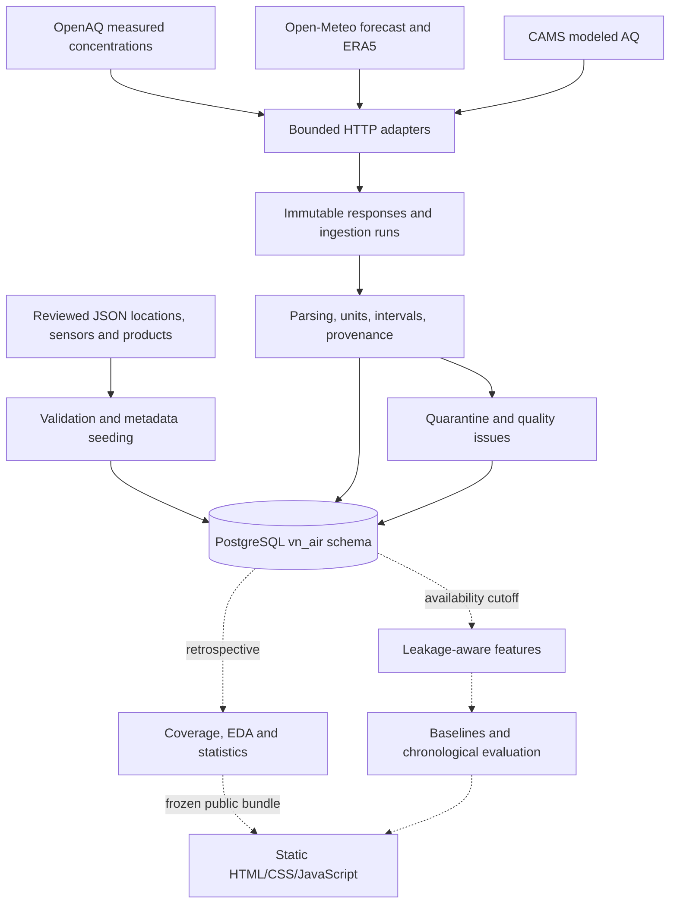

# Architecture

Phase 2 implements the PostgreSQL schema, migrations, reviewed configuration and
setup tooling. Phase 3 adds [on-demand ingestion](ingestion.md), retained raw
evidence, resumable backfill and basic quality checks. Phase 4 adds a frozen,
read-only data-quality audit. Phase 5 adds descriptive EDA artifacts based on
that frozen audit. Phases 6–9 provide frozen statistics, availability-aware
features, baselines and chronological ML diagnostics. Phase 10 presents the
evidence through a static local dashboard. Scheduling and deployment remain
future work. The design follows
[Decision 0001](decisions/0001-data-sources.md) and the
[authenticated source audit](research/openaq_qualification.md).

## Boundaries

Keep the application as a Python package and a small set of jobs. PostgreSQL is
the single historical store; no Kafka, Redis, task queue, API microservice or
TimescaleDB is needed for this volume. Retaining responses in PostgreSQL makes
provenance transactional and keeps early deployment simple. Revisit compression,
object storage or partitioning only after measuring growth.

## Implemented Components

| Path | Responsibility |
| --- | --- |
| `configs/study.json` | Reviewed three-city/two-sensor metadata, products, units, physical bounds and API options |
| `src/vn_air/config.py` | Strict Pydantic validation, cross-reference checks, unknown/duplicate-key rejection |
| `src/vn_air/database/migrations/` | Versioned PostgreSQL DDL and Alembic execution environment |
| `src/vn_air/database/setup.py` | Explicit PostgreSQL selection, serialized transactional migrations and idempotent seeding |
| `src/vn_air/cli.py` | Config validation, schema upgrade/status, metadata seed commands |
| `src/vn_air/ingestion/` | HTTP transport, pure parsers, transactional chunks, resume and aggregate reports |
| `scripts/test_database.py` | Disposable Unix-socket-only PostgreSQL test cluster, independent of the existing service |
| `tests/integration/test_schema.py` | Real PostgreSQL constraint, revision, provenance and migration tests |
| `scripts/build_dashboard.py` | Stdlib-only hash-verified public projection of frozen Phase 5–9 artifacts |
| `dashboard/` | Read-only browser interface, local JSON, responsive themes, charts and tables |
| `scripts/serve_dashboard.py` | Loopback static asset allowlist; no database endpoints or repository listing |

Phase 10 uses dependency-free static web assets in place of the roadmap's
initial Streamlit/Plotly suggestion. The browser reads the generated public
bundle only; it does not query PostgreSQL or load raw source payloads. Source
hashes, scientific scope and the exact known Phase 5 README metadata exception
are documented in the Phase 10 verification record. Public/static deployment
and any direct database dashboard access would require a separate access and
licensing review; the current loopback preview does not expose Supabase.

The SQL migration is the schema authority. SQLAlchemy provides connections and
bound parameters; Alembic records migration versions. There is no parallel ORM
model hierarchy to keep synchronized. Plain analytical SQL and later DataFrames
remain first-class interfaces.

## Source Contracts

See [source_contracts.md](source_contracts.md) for exact adapter and transaction
requirements. The first measured targets are CMT8 and OceanPark, not city averages.
Station-to-city parent links mean analytical regional context, not verified
administrative-boundary membership. Da Nang has a city context record and **no
sensor**, making the lack of measured coverage explicit.

Weather for measured-data analysis must be requested at **station coordinates**.
City-centre coordinates support modeled context views only. Both requested and
returned grid coordinates are retained in model snapshots. Exact sensor siting
and calibration remain qualification tasks, not facts inferred by this schema.

Weather forecasts pin `ecmwf_ifs` in the reviewed configuration rather than the
changing `best_match`. This product choice follows the researched API contract;
the Phase 3 smoke test must verify the configured request before collection.
ERA5 and CAMS Global are separate products. The `source_products` discriminator
and composite foreign keys prevent modeled AQ from becoming measured sensor data.

## Data Lifecycle

1. Validate reviewed configuration and seed new reference metadata in a
   transaction. Store the normalized document and SHA-256 hash. Existing records
   must match; changed identities/options fail instead of silently updating.
2. Start an ingestion run with product, configuration hash, pipeline version,
   purpose and requested time window. Commit the start so failures remain visible.
3. Record every attempt, HTTP status/error code, allowlisted request parameters,
   actual request/retrieval timestamps and credential-free raw bytes. PostgreSQL
   computes their SHA-256. Responses are append-only.
4. Parse each response. Store canonical rows, missing/invalid markers, quarantine
   locators and quality issues in bounded transactions. Keep the raw response even
   if parsing or normalization fails. Count inserted/unchanged/quarantined records.
5. Finalize the run as succeeded, partial or failed with counts and error code.
   Mark interrupted stale runs failed on restart; database exceptions cannot
   substitute for ingestion logs or recovery logic.

All five steps now have a bounded Phase 3 implementation. Recovery resumes whole
failed chunks, not individual pages; the runbook documents limitations. There is
no unattended scheduler or full scientific quality-monitoring pipeline yet.

## Provenance And Time

`period_start` and `period_end` identify a measured hourly interval. `valid_at`
identifies a model value; its temporal support distinguishes instantaneous values
from preceding-hour totals/means. SQL uses `timestamptz`, connection timezone UTC,
and original provider metadata remains in source responses. Local features use
`Asia/Ho_Chi_Minh`.

`retrieved_at` records receipt of a response. `recorded_at` records normalized row
insertion. Neither is a fabricated historical availability timestamp. Ingestion
must atomically commit a snapshot and its values, then select only committed
data at subsequent forecast origins. An in-progress transaction is not an input
even if its row-default timestamp precedes the origin. Provider publication and
initialization times remain nullable unless the provider gives real evidence.

Model data never become observations just because their valid time is past.
Historical ERA5 and CAMS archives can include later information. An archived
forecast from a retrospective request is not an as-issued operational forecast
without verified run/publication evidence.

## Analytical Layers

- **Retrospective:** choose a pinned source/model and latest revision within a
  frozen extraction cutoff. Build an explicit hourly grid; count gaps before
  joining weather. Do not average all forecast snapshots at a valid time.
- **Operational:** use values committed and available by each origin. Select the
  latest eligible revision/snapshot **after applying the origin cutoff**, then
  assess quality. The `latest_air_quality` view is not an as-of view.
- **Historical assumptions:** when original availability is unknown, record an
  assumed lag scenario as retrospective, with no invented availability timestamp.
  `model_predictions` explicitly separates this from captured-availability runs.
- **Evaluation:** shared chronological cutoffs, purged target windows, baseline
  comparisons on identical eligible targets, and a held-out final period. Feature
  pipelines must prove their own lineage; schema constraints alone cannot prove
  absence of leakage.

The chosen prediction contract is hourly PM2.5 mean over
`[origin + horizon - 1 hour, origin + horizon)`, with a target period end at the
stated horizon. Initial candidate horizons remain 6 and 24 hours. At least one
full common annual cycle is still needed for annual seasonal claims.

## Operations

Use one project database with the owned `vn_air` schema and
`public.vn_air_schema_version`. CLI migrations refuse maintenance/template
databases, use a transaction and advisory lock, and never create roles or
databases implicitly. The operator creates the dedicated database.

Raw payloads can contain location metadata and are not dashboard endpoints.
Only reviewed licensed subsets should be published. Credentials live outside
configuration; adapters must reject/redact echoed secrets before storing bytes.
The SQL top-level parameter denylist is a guardrail, not a complete secret scanner.

For deployment, separate migration, ingestion and read-only analysis roles and
restrict network/database access. The schema includes append-only row triggers,
not tamper-proof storage against an owner/superuser or `TRUNCATE`. Do not grant
runtime jobs owner, schema creation, trigger-management or truncate permissions.
Role provisioning, backup/restore drills and monitoring belong to the automation
phase. [Database setup](database.md) gives the current commands and limits.
