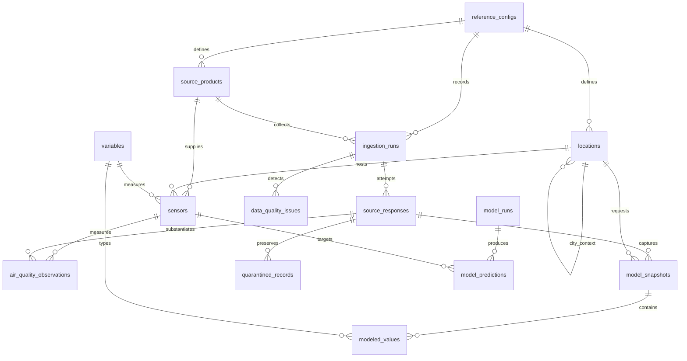

# Database Design And Setup

Requires PostgreSQL 15+ and Python 3.11+. Phase 2 provides the initial schema and
reviewed reference metadata; Phase 3 provides [live ingestion](ingestion.md).
The initial migration lives at
[`0001_environmental_core.sql`](../src/vn_air/database/migrations/versions/0001_environmental_core.sql).
No extensions are required; response hashing uses PostgreSQL's built-in SHA-256.

## Tables

| Table In `vn_air` | Purpose / Key |
| --- | --- |
| `reference_configs` | Immutable normalized configuration document keyed by SHA-256 |
| `source_products` | Provider, endpoint, licence, domain and measurement/reanalysis/forecast kind |
| `variables` | Canonical units, representation, physical bounds and model temporal support |
| `locations` | Stable city and station IDs, coordinates, timezones, city context parent |
| `sensors` | External station/sensor IDs, measurement product, concentration unit, instrument and licence dates |
| `ingestion_runs` | Product/config/pipeline version, requested window, state and counts |
| `source_responses` | Per-attempt bytes, computed hash, safe parameters, retrieval time and HTTP/error status |
| `air_quality_observations` | Measured hourly concentration revisions, source response, quality and metadata snapshot |
| `model_snapshots` | Provider model/reanalysis capture at a location; requested and grid coordinates, run provenance |
| `modeled_values` | One variable/valid time per snapshot, unit, interval/cadence, value and quality |
| `quarantined_records` | Bad record locator and reason tied to retained raw response |
| `data_quality_issues` | One response/observation/modeled value/sensor target, diagnostics, resolution, optional gap window |
| `model_runs` | Version, horizon, training cutoff, fit time, feature/code/data-manifest versions and optional actual metrics |
| `model_predictions` | Target sensor/interval, forecast origin, horizon, prediction and optional labeled uncertainty |
| `ingestion_checkpoints` | Completed exact target/window/config/pipeline backfills for explicit resume |

Alembic uses `public.vn_air_schema_version`. No rows in model tables or measurement
tables are seeded. Synthetic test data exist only in a disposable test cluster.
`model_runs.training_started_at` is the start of the training **data window**;
`fitted_at` records completion of computation. Actual feature/data manifests and
evaluation metrics will be supplied by the later modeling pipeline.

Current Alembic head is `0003_response_integrity`. Forward migration 0002 adds
target/request provenance, content/query hashes, checkpoints and RLS hardening;
0003 ensures canonical rows cannot use withheld/errored response bytes. All tables
are private by default with RLS and no browser policies. These migrations preserve
owner access for the backend, not a ready-made least-privilege runtime role.



## Keys And Constraints

- Measurements: unique `(sensor_id, period_start, period_end, revision)` and
  `(sensor_id, period_start, period_end, response_id)`. A self-FK requires the
  previous revision; checks reject backward revision/retrieval chronology.
- Model captures: unique `(response_id, location_id, model_key)`. Values unique
  by `(snapshot_id, variable_code, valid_at)`. Multiple captures can retain
  different predictions for the same future time.
- Composite foreign keys enforce product kind/domain, sensor/variable/unit,
  source-response/product and forecast-horizon consistency. A CAMS response
  cannot be attached to an OpenAQ measured observation.
- Coordinates have valid global bounds. Pydantic configuration restricts country
  to VN and validates provider timezones; SQL restricts the project's normalized
  timezone. Global bounds alone cannot prove a point lies inside Vietnam.
- Canonical numbers reject NaN/infinities; concentration is nonnegative. Humidity
  and cloud cover stay within 0-100. Missing/invalid markers require null values.
  PM2.5 has no arbitrary high cutoff, so extreme values remain investigable.
- Measurement intervals are complete hourly periods, within reviewed sensor
  licence dates, and no later than retrieval. Source publication cannot exceed
  retrieval; run initialization cannot be a fabricated future time.
- Prediction target ends equal origin plus horizon and span the preceding hour.
  Training cutoff cannot exceed origin. Operational model fitting precedes
  origin; captured feature availability cannot exceed origin. Explicit assumed
  availability is allowed only for labeled retrospective experiments.

Time-range indexes cover sensor/period/revision, location/product/capture time,
model variable/valid time, prediction target and ingestion history. Foreign-key
and unique indexes also support lookups. Open quality issues have a partial index.
Measure actual analytical queries before adding broader indexing/partitioning.

## Views

`latest_air_quality` returns the latest revision per measured interval, including
null/missing/invalid revisions. **Filter quality after revision selection**, not
before, or a rejected revision could resurrect an old valid value.

`weather_observations` is a convenience view of **modeled weather/reanalysis**,
with an explicit `data_kind`; the name does not make these station measurements.
`modeled_air_quality` provides the separate modeled AQ stream. Neither view
selects a single forecast vintage, and neither is an as-of model-input dataset.

Example as-of measured query, to execute with a bound `origin` parameter:

```sql
SELECT * FROM (
    SELECT DISTINCT ON (o.sensor_id, o.period_start, o.period_end) o.*
    FROM vn_air.air_quality_observations AS o
    JOIN vn_air.source_responses AS r ON r.id = o.response_id
    WHERE o.period_end <= :origin
      AND r.retrieved_at <= :origin
      AND o.recorded_at <= :origin
    ORDER BY o.sensor_id, o.period_start, o.period_end, o.revision DESC
) AS eligible
WHERE quality_status = 'accepted';
```

This query only sees committed rows. The future predictor must execute against a
snapshot of data committed before its origin; insertion timestamps alone are not
commit timestamps. Backfilled data retrieved today are not eligible at origins
last year. Model inputs additionally filter snapshot/value insertion times,
capture retrieval and product provenance, then choose one eligible vintage.

## Install

From the repository root:

```bash
python3 -m venv .venv
.venv/bin/python -m pip install -r requirements.lock
.venv/bin/python -m pip install --no-deps .
.venv/bin/vn-air validate-config configs/study.json
```

Runtime versions are pinned in `requirements.lock`; `pyproject.toml` declares
supported ranges. The lock records the verified macOS arm64 environment; optional
platform dependencies on other systems may need additional resolution. Do not
claim the exact environment was tested on every platform. Dependency updates
require rerunning schema and configuration tests.

A regular install includes migrations and SQL as package data. After source edits,
reinstall with `--no-deps .`, or use `PYTHONPATH=src` for source-development commands.
On this macOS installation, editable-install `.pth` files inherited the hidden
flag and Python 3.13 skipped them. The regular install avoids that issue; no
global interpreter changes are required.

## Create And Migrate

Choose a new dedicated database. On the inspected machine, local Unix-socket
authentication uses the current OS PostgreSQL role:

```bash
createdb vietnam_environment
export DATABASE_URL='postgresql+psycopg:///vietnam_environment'
.venv/bin/vn-air db upgrade
.venv/bin/vn-air db seed --config configs/study.json
.venv/bin/vn-air db status
```

`createdb` is a one-time operator action and fails if the database exists. Do not
drop or overwrite an existing database to rerun setup. Rerunning upgrade/seed on
this project schema is supported and tested. For TCP/remote use, supply your own
least-privilege role and an appropriately protected connection string via
`DATABASE_URL`/secret store, never command-line secrets. Use provider-required
TLS verification for remote PostgreSQL.

The CLI requires an explicit database and rejects `postgres` for local/non-Supabase
connections; template databases are always rejected. Supabase projects are the
supported exception for database `postgres`, with a Supabase host and required TLS. See the
[Supabase setup](supabase.md). It only owns `vn_air` and its migration-version table. No automatic
database creation, destructive reset, rollback CLI or secret `.env` loading exists.
If a nonmatching `vn_air` schema exists, upgrade fails transactionally instead of
claiming success. Run migrations once per deployment; an advisory transaction
lock serializes competing project upgrades/seeds.

Expected seed content: **4 products, 16 variables, 5 locations, 2 sensors**, one
reference configuration. The second seed inserts zero records. Existing IDs and
product options must match. Adding newly qualified locations is a configuration
change; changing existing identity/siting/licensing needs a reviewed version or
explicit metadata migration, not a silent update to historical meaning. Removing
an entry from config does not delete historical reference metadata or data.

## Test

Offline tests, including Phase 1 artifacts and configuration:

```bash
PYTHONPATH=src .venv/bin/python -B -m unittest discover -s tests -v
```

Export the authorized key from a trusted local environment only if you want the
exact-key leak check; otherwise that check skips. No API calls occur in tests.

Real PostgreSQL tests require `initdb`, `pg_ctl`, and `createdb` on PATH:

```bash
PYTHONPATH=src .venv/bin/python -B scripts/test_database.py
```

The runner creates a randomly named temporary cluster, disables TCP listening,
uses a private local socket and fixed test role/database, runs tests and shuts
down/removes its own cluster. It never uses `DATABASE_URL` or the existing service.
If the OS temporary path is too long for Unix sockets, pass `--temp-parent` with
an existing shorter private directory. Test server `fsync=off` is confined to the
disposable cluster and must not be copied into deployment configuration.

The migration lifecycle test covers upgrade, repeat upgrade, downgrade to base,
re-upgrade and reseed in an isolated transaction. Downgrade explicitly drops
owned objects without CASCADE into unowned objects. It is destructive to project
data and is not exposed as a routine user command.

## Limits

Append-only triggers prevent ordinary updates/deletes, not superuser actions or
TRUNCATE; enforce runtime privileges during deployment. They also mean retention
and lawful deletion need an explicit operator migration, not hidden cleanup jobs.
Source-data licences are reviewed metadata, not legal guarantees inferred by SQL.
Input JSON byte arrays and text metadata still require adapter-level secret
redaction, allowlists, row-size limits and logging discipline.

Quality issue storage is not comprehensive monitoring, and model result tables
are not trained models. Phase 3 adds parsers and on-demand ingestion, documented
in [ingestion.md](ingestion.md). A scheduler, backups, forecast evaluation and
dashboard remain future phases. See [architecture.md](architecture.md).
