# Frozen Phase 5 EDA

OpenAQ; AirGradient; Thomas Versteeg (CMT8); Open-Meteo; ERA5/Copernicus C3S; CAMS Global. CC BY 4.0.

Source data normalized, selected and aggregated; no imputation. See ../phase_5.md for findings and limits.

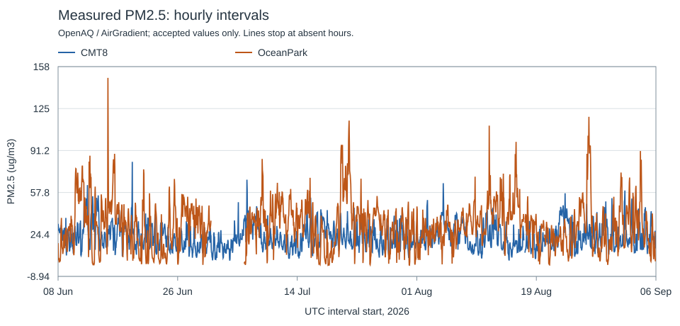

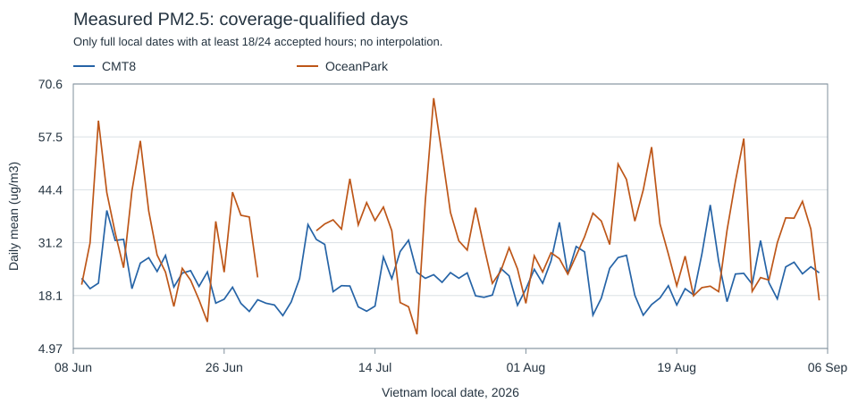

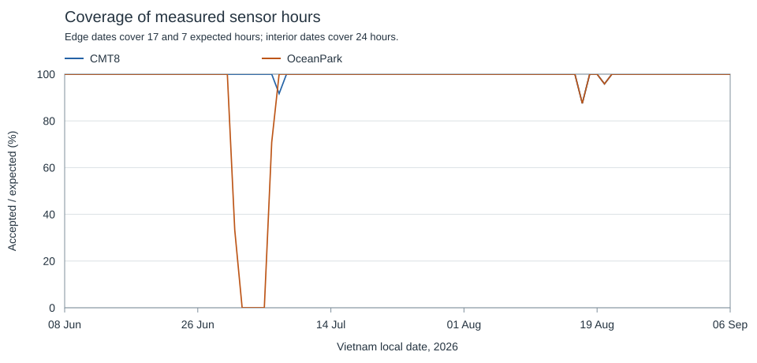

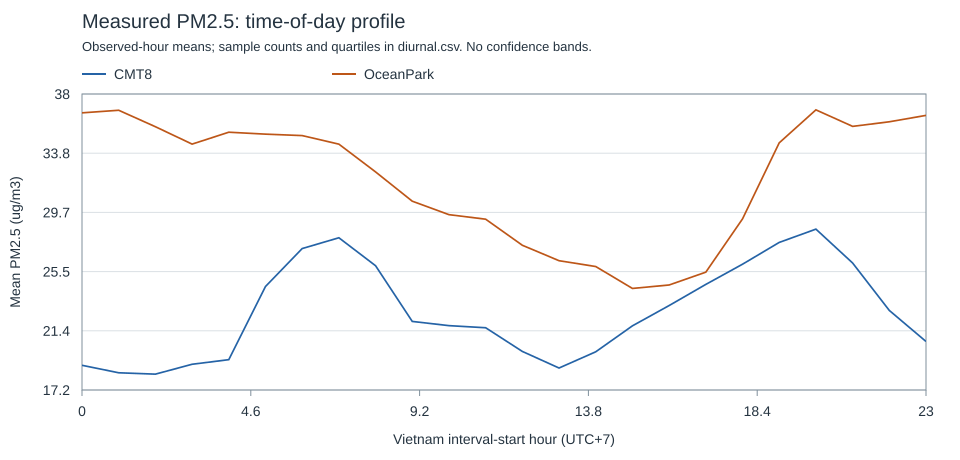

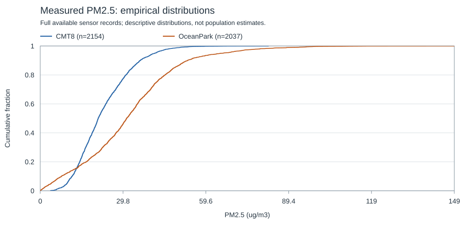

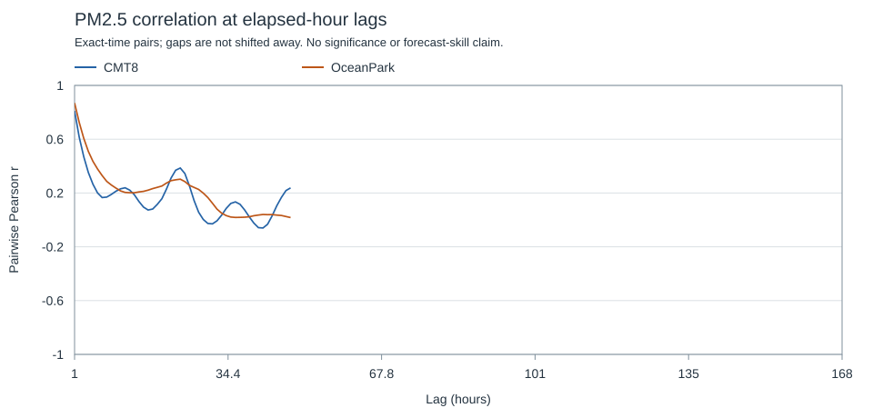

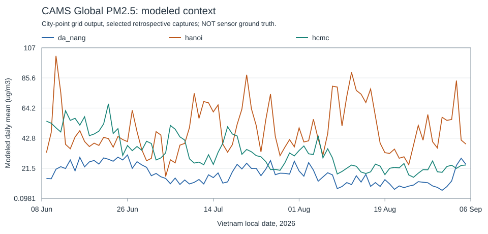

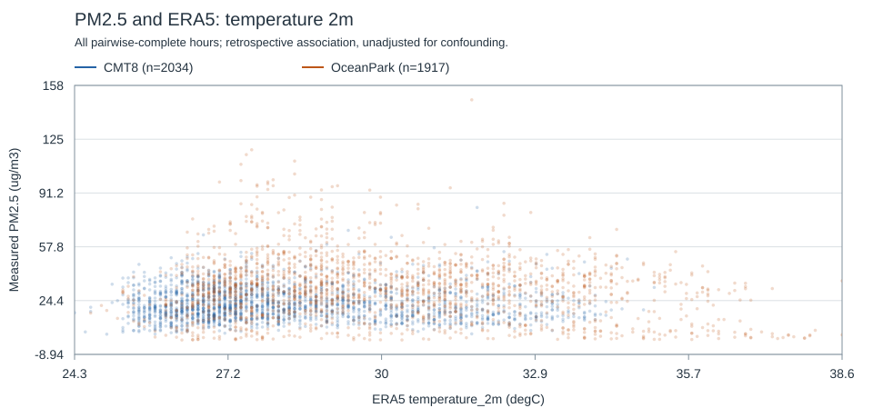

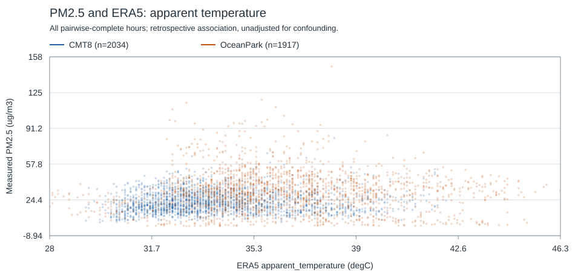

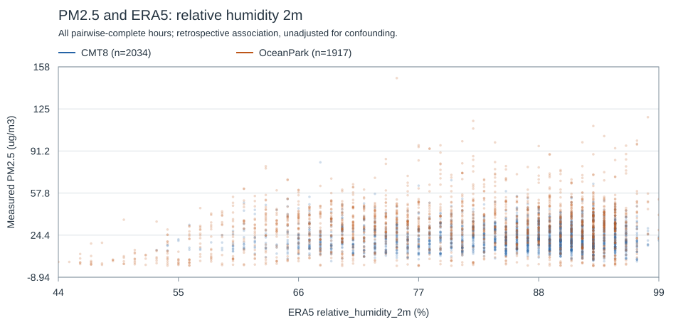

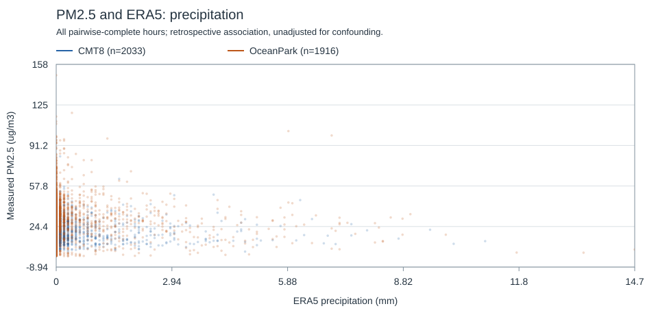

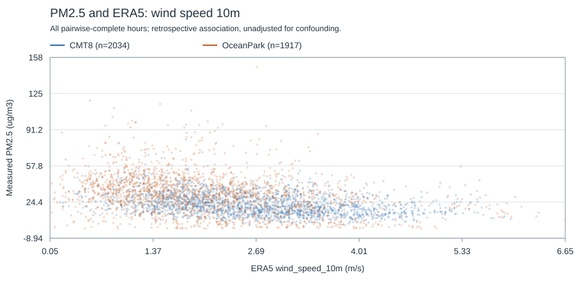

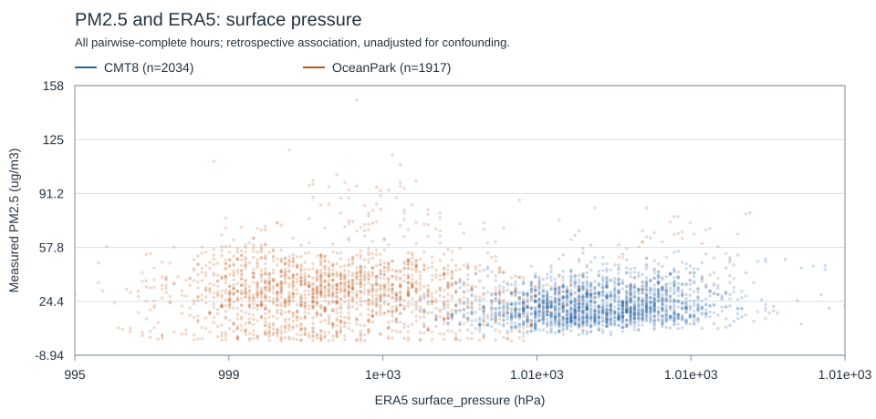

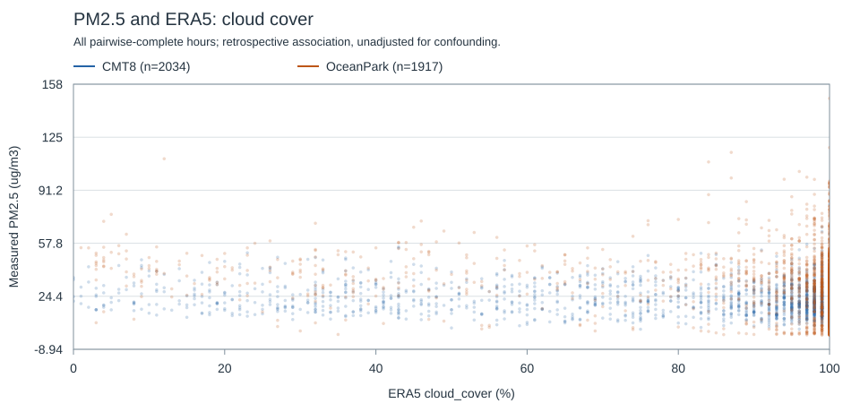

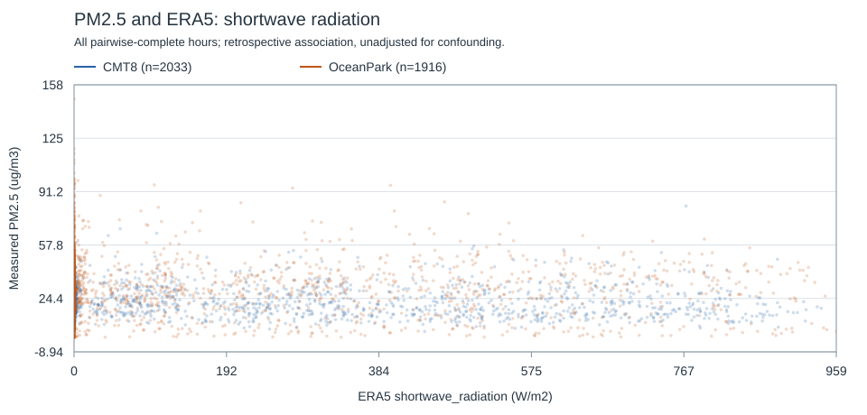
